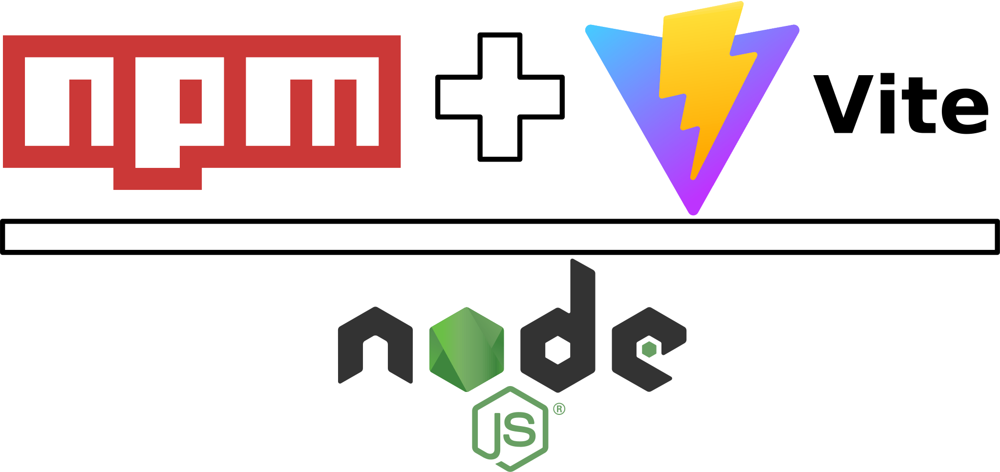
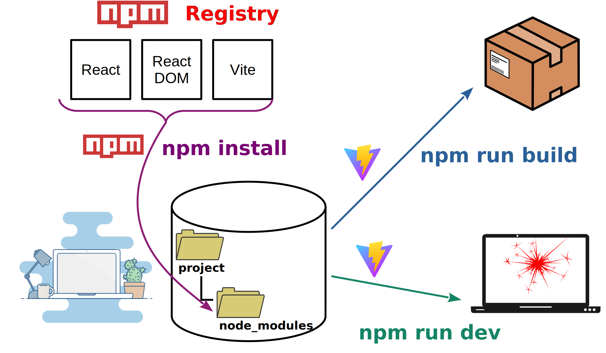
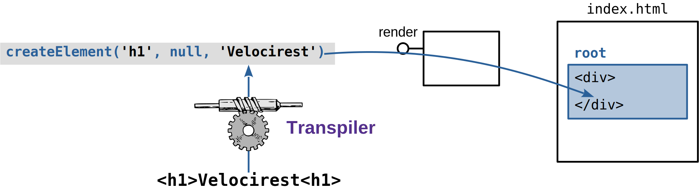
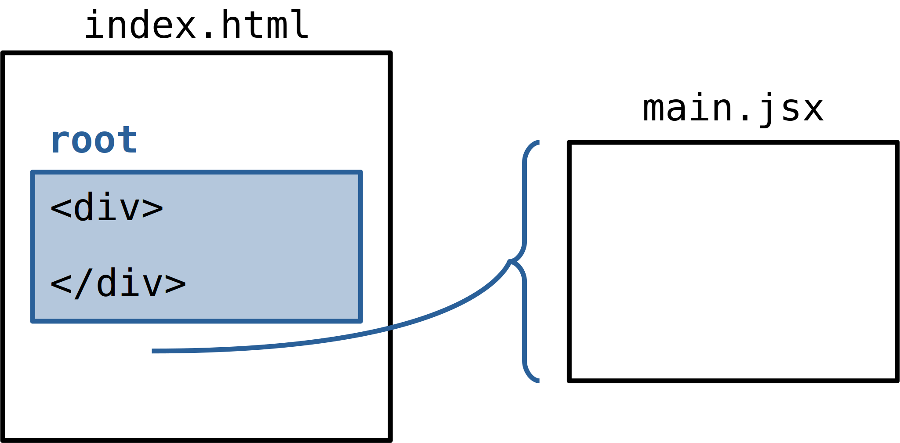
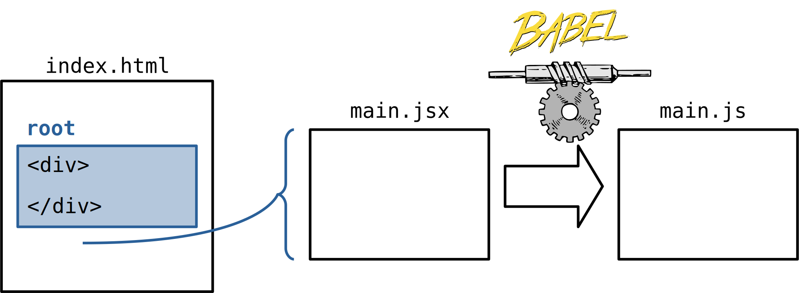

Black & White Series

# React Development Environment

#### Thinking in React

---

<!-- class: lead -->

# React Program in an Environment

Available at: [frameworks/react/3-js-file](https://github.com/santanche/web2learn/tree/master/frameworks/react/3-js-file)

---

# Development Environment

* **Registry**: download, update, and manage local libraries and coding tools:
  * libraries: React, Bootstrap, Chart, etc.
  * coding tools: transpiler, linter, resolver, etc.
* **Run** coding tools:
  * online for testing;
  * batch for deployment.
* **Bundler**: connect, pack, and deploy the package or application.

---

# Development Environment

* Registry
* Run coding tools
* Bundler

---

# `package.json` and Environment

* `package.json` - records libraries/development dependencies and development task scripts;
* `package-lock.json` - a picture of the current setup;

---

# Library Dependencies

`package.json`
~~~json
"dependencies": {
  "react": "^18.3.1",
  "react-dom": "^18.3.1"
},
~~~

---

# Development Dependencies

`package.json`
~~~json
"devDependencies": {
  "@eslint/js": "^9.8.0",
  ...
  "@vitejs/plugin-react": "^4.3.1",
  "eslint": "^9.8.0",
  ...
  "globals": "^15.9.0",
  "vite": "^5.4.0"
}
~~~

---

# Scripts

`package.json`
~~~json
"scripts": {
  "dev": "vite",
  "build": "vite build",
  "lint": "eslint .",
  "preview": "vite preview"
},
~~~

---

# `vite.config.js`

Specific Vite configurations

~~~js
import { defineConfig } from 'vite'
import react from '@vitejs/plugin-react'

// https://vitejs.dev/config/
export default defineConfig({
  plugins: [react()],
})
~~~

---

---

# JSX and Babel Transpiler

~~~html

~~~

---

# Independent JS File

---

# Babel via Dev/Building

---

# Babel via Dev/Building

---

# References

* [Writing Markup with JSX](https://react.dev/learn/writing-markup-with-jsx)

---

<!-- class: invert -->

## André Santanchè

www.ic.unicamp.br/~santanch/

## Web2Learn

santanche.github.io/web2learn/