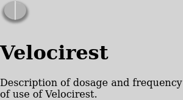
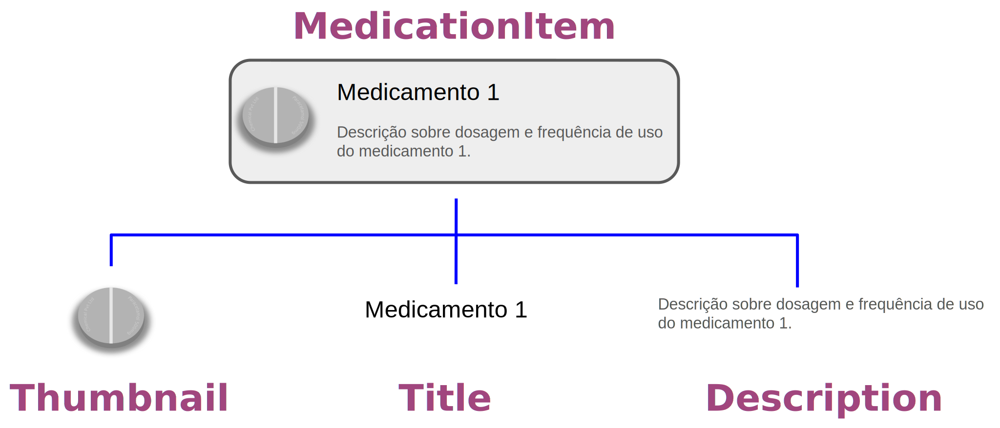
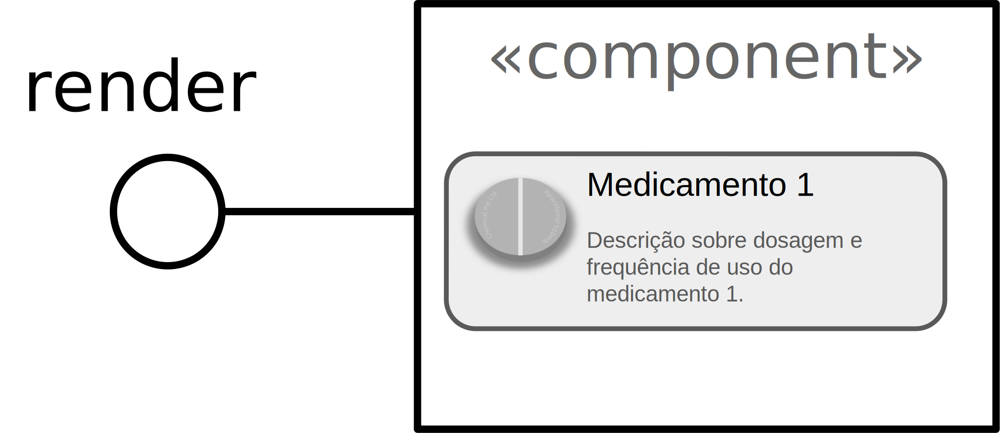
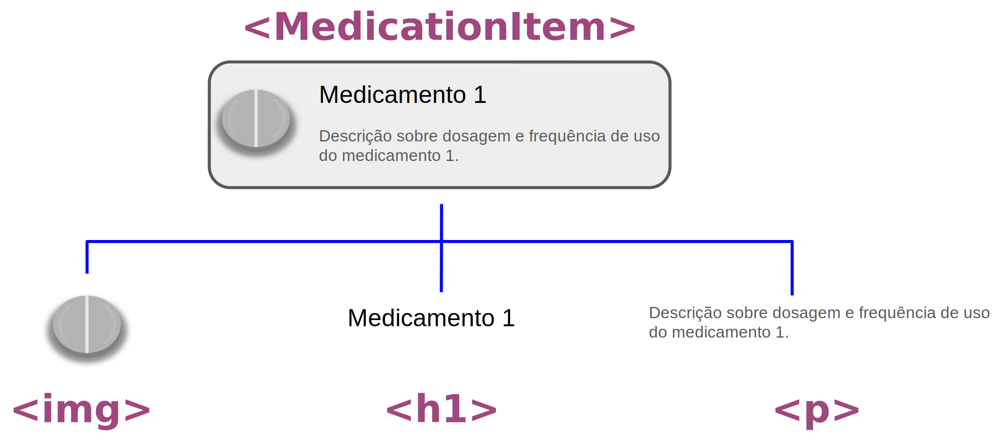
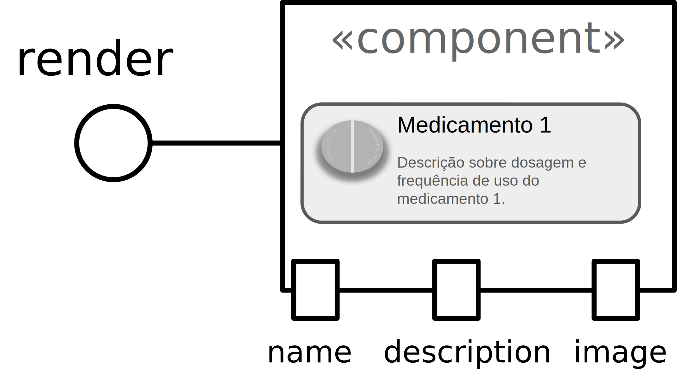
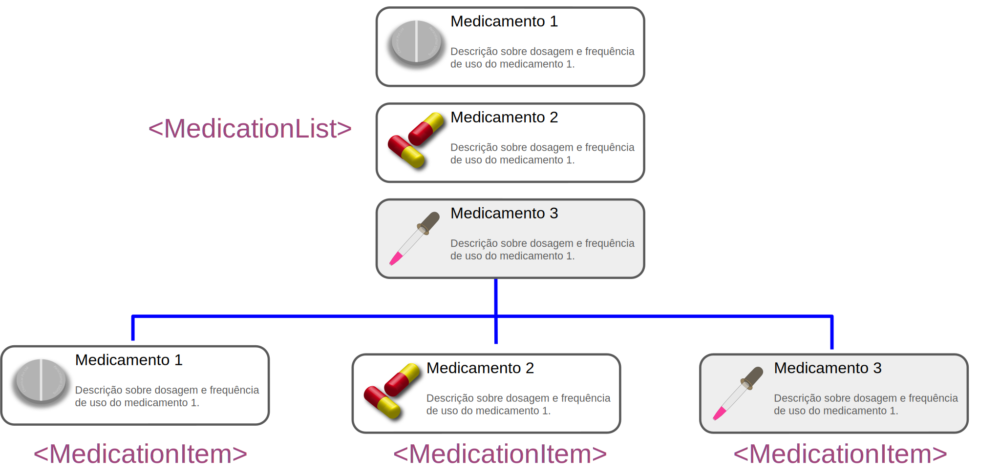
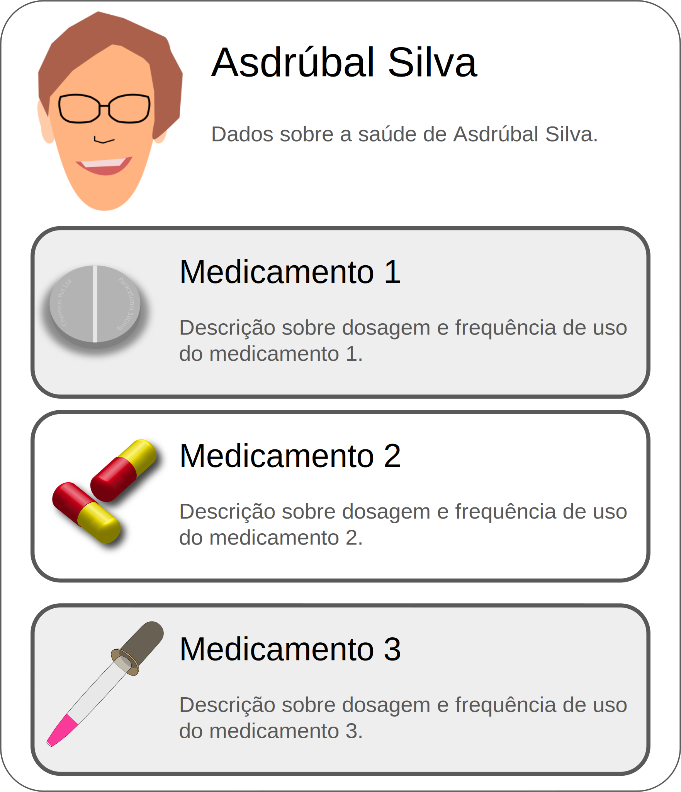
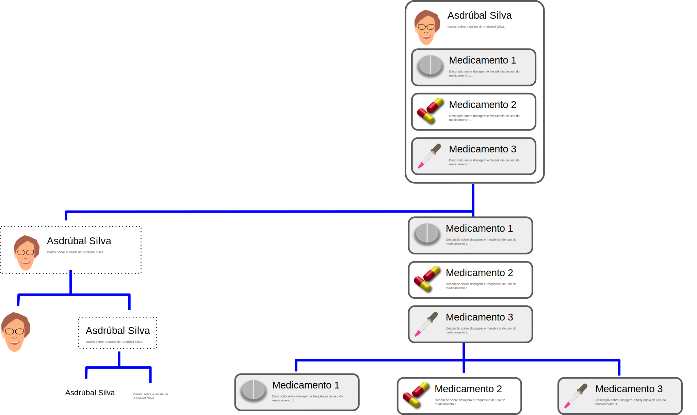

Black & White Series

# React Components

#### Thinking in React

---

<!-- class: lead -->

# React

* https://react.dev/

---

# React Component

Available at: [frameworks/react/4-component](https://github.com/santanche/web2learn/tree/master/frameworks/react/4-component)

---

#### HTML Specification
# Component Step 1

~~~html

  
  <h1>Velocirest</h1>
  
Description of dosage and frequency of use of Velocirest.

~~~

---

# Component Predefined

~~~javascript
export default function MedicationItem() {
  return 

           
           <h1>Velocirest</h1>
           
Description of dosage and frequency of use of Velocirest.

         

}
~~~

---

# MedicationItem Design

---

## MedicationItem React

---

# Component Hierarchy

Available at: [frameworks/react/5-hierarchy](https://github.com/santanche/web2learn/tree/master/frameworks/react/5-hierarchy)

---

## MedicationItem with Properties

---

# Component with Properties

~~~javascript
export default function MedicationItem({ name, description, image }) {
  return 

           
           <h1>{name}</h1>
           
{description}

         

}
~~~

---

# MedicationList Design

---

# Aggregating Components

~~~javascript
export default function MedicationList() {
  return <>
           <MedicationItem name="Velocirest"
                           description="Description of dosage and frequency of use of Velocirest."
                           image="/src/assets/medication1.svg" />
           <MedicationItem name="Tricerabust"
                           description="Description of dosage and frequency of use of Tricerabust."
                           image="/src/assets/medication2.svg" />
           <MedicationItem name="Tyrannotonic"
                           description="Description of dosage and frequency of use of Tyrannotonic."
                           image="/src/assets/medication3.svg" />
         </>
}
~~~

---

# Tarefa

* Baseado no design desenvolvido na tarefa do Figma, crie um componente que crie um componente com que represente a ficha completa do paciente com os medicamentos que ele toma:

---

# Tarefa

---

<!-- class: invert -->

## André Santanchè

www.ic.unicamp.br/~santanch/

## Web2Learn

santanche.github.io/web2learn/