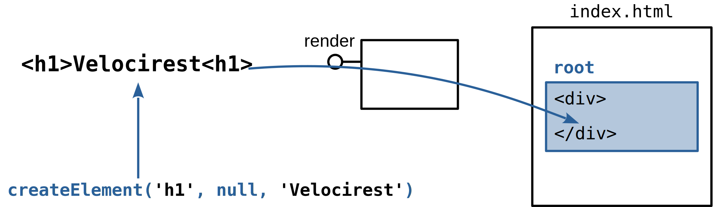

Black & White Series

# React Components

#### Thinking in React

---

<!-- class: lead -->

# React

* https://react.dev/

---

# React Component

Available at: [frameworks/react/4-component](https://github.com/santanche/web2learn/tree/master/frameworks/react/4-component)

---

#### HTML Specification
# Component Step 1

~~~html

  
  <h1>Velocirest</h1>
  
Description of dosage and frequency of use of Velocirest.

~~~

---

#### HTML Specification
# Component Step 1

~~~javascript
export default function MedicationItem() {
  return 

           
           <h1>Velocirest</h1>
           
Description of dosage and frequency of use of Velocirest.

         

}
~~~

---

#### First React Program
# Importing Libraries from CDN

CDN - Content Delivery Network

~~~html

~~~

---

# First React Program - Script

~~~js
const root = ReactDOM.createRoot(
  document.getElementById('root')
)
~~~

---

# First React Program - Script

~~~js
root.render(
  React.createElement('h1', null, 'Velocirest')
)
~~~

---

# JSX

* Proposed by Facebook
  * https://facebook.github.io/jsx/
* XML constructs within JavaScript
* Requires the use of a Transpiler (preprocessor)

---

# React with JSX

Available at: [frameworks/react/2-basic-jsx](https://github.com/santanche/web2learn/tree/master/frameworks/react/2-basic-jsx)

---

---

---

---

# React with JSX

~~~js
root.render(
  <h1>Velocirest</h1>
)
~~~

---

# JSX and Babel Transpiler

~~~html

~~~

---

# Babel Transpiler

---

# References

* [Writing Markup with JSX](https://react.dev/learn/writing-markup-with-jsx)

* [React createRoot](https://react.dev/reference/react-dom/client/createRoot)

* [React createElement](https://react.dev/reference/react/createElement)

* [Eloquent JavaScript](https://eloquentjavascript.net/)

---

<!-- class: invert -->

## André Santanchè

www.ic.unicamp.br/~santanch/

## Web2Learn

santanche.github.io/web2learn/