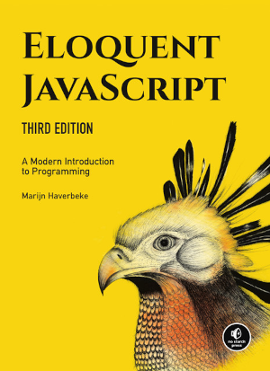

Black & White Series

# JavaScript Environment

#### JavaScript for C or Java Programmers

---

<!-- class: lead -->

# JavaScript

* Invented by Brendan Eich at Netscape
* ECMAScript -> standardization (ECMA, 2011)
* Originally for small in-browser scripts
* Local hardware access limitations
  * security
  * platform independence

---

# Recomended Book

  
https://eloquentjavascript.net/

---

# Experimental environment

### Javascript Playground (https://playcode.io/)
interactive environment ideal for starters

---

# Inspection Output

~~~js
console.log(<string>)
~~~

* A simple form of producing outputs for:
  * inspection
  * learning
* Not presented on the page
  * unfit for application output

~~~js
console.log('The dinosaur jumped into the mud')
~~~