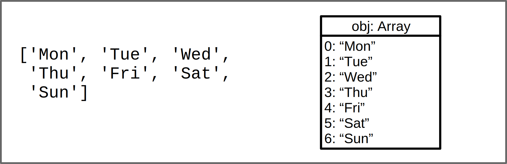
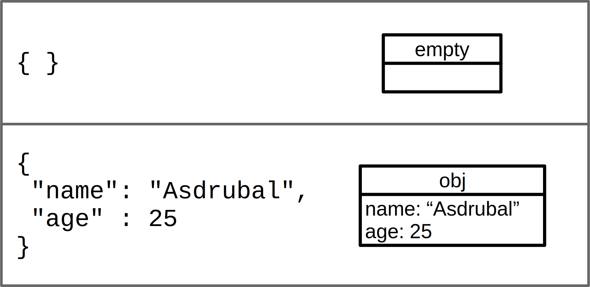
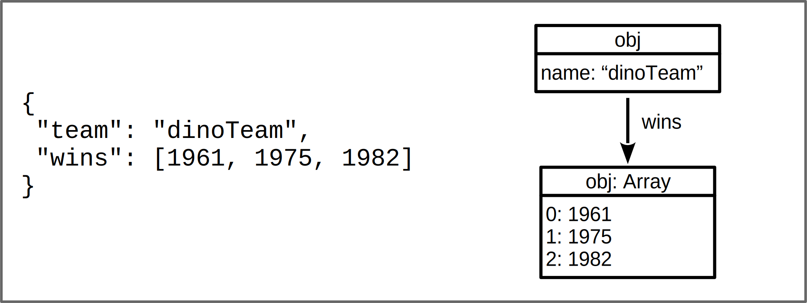
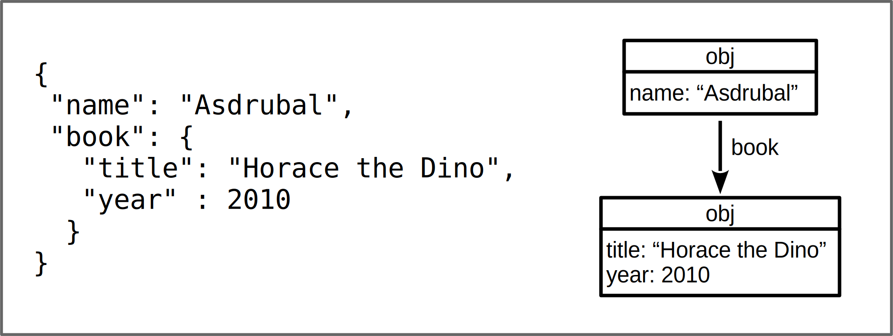

Black & White Series

# Array and Object Literals

---

<!-- class: lead -->

# Array Literal

---

# Array Literal Use

~~~javascript
[<value1>, ..., <valuen>]
~~~

~~~javascript
const daysOfWeek = ['Mon', 'Tue', 'Wed', 'Thu', 'Fri', 'Sat', 'Sun']
const day = Math.trunc(Math.random() * 7)
console.log('Weekday: ' + day + ' - ' + daysOfWeek[day])
console.log(daysOfWeek)
~~~

~~~
Weekday: 0 - Mon
["Mon", "Tue", "Wed", "Thu", "Fri", "Sat", "Sun"]
~~~

---

# Simple Object Literals

---

# Object Literal with Array

---

# Object inside Object

---

# JSON

### JavaScript Object Notation

* Open object exchange standard
* Based on JavaScript object literal
* Incorporated into ECMAScript (2011)
* Adopted by several languages
  * http://json.org/

---

# Object Literal

~~~javascript
{
  <attr1>: <value1>
  ...
  <attrn>: <valuen> 
}
~~~

* `<attr>`
  * without quotes - as a variable name
  * with quotes - any valid string
    * JSON requires quotes

---

# Object Literal

~~~javascript
{
  <attr1>: <value1>
  ...
  <attrn>: <valuen> 
}
~~~

* `<value>`
  * any literal
    * number, string, array, or another object

---

# Example - Dot Notation

~~~javascript
const author = {
  name: 'Asdrubal',
  age:  25
}
console.log(author.name)
author.age = 30
console.log(author)
~~~

~~~
Asdrubal
{name: "Asdrubal", age: 30}
~~~

---

# Example - Bracket Notation

~~~javascript
const author = {
  name: 'Asdrubal',
  age:  25
}
console.log(author['name'])
author['age'] = 30
console.log(author)
~~~

~~~
Asdrubal
{name: "Asdrubal", age: 30}
~~~

---

# Object as a Dictionary

~~~javascript
const author = {
  'First Name': 'Asdrubal',
  'Last Name': 'Montequio'
}
console.log(author['First Name'])

const ln = 'Last Name'
author[ln] = 'Capuleto'
console.log(author)
~~~

~~~
Asdrubal
{First Name: "Asdrubal", Last Name: "Capuleto"}
~~~

---

# References

* Mozilla MDN - https://developer.mozilla.org

* Eloquent JavaScript - https://eloquentjavascript.net/

---

<!-- class: invert -->

## André Santanchè

www.ic.unicamp.br/~santanch/

## Web2Learn

santanche.github.io/web2learn/