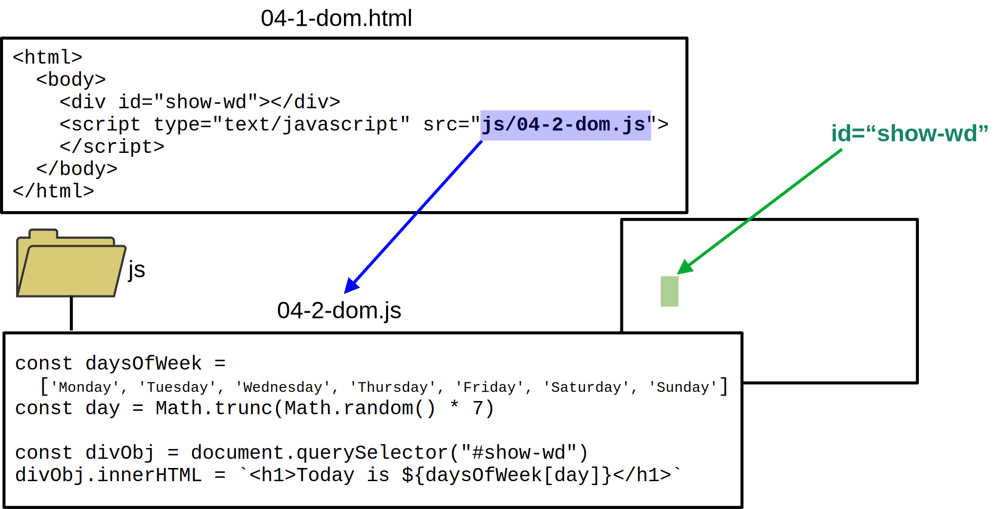

Black & White Series

# DOM

#### Document Object Model

---

<!-- class: lead -->

# Web Layers

---

# DOM Tree

---

# JavaScript DOM View

---

# Defining a `span` Target

---

# Importing an External JS

---

# Retrieving the `span` Object

---

# Inserting HTML content

---

# CSS Selectors

| selector   | syntax       | examples   |
|------------|--------------|------------|
| type       | tag name     | `p`, `h1`  |
| classe     | `.classname` | `.story`   |
| identifier | `#idname`    | `#show-wd` |

**Reference:** [mdn CSS selectors](https://developer.mozilla.org/en-US/docs/Web/CSS/CSS_Selectors)

---

# `document.querySelector`

~~~js
querySelector(<selector>)
~~~

* Returns the first element within the document that matches the selector
* This element is a DOM object

**Reference:** [mdn Document.querySelector()](https://developer.mozilla.org/en-US/docs/Web/API/Document/querySelector)

---

# `Element.innerHTML`

* JavaScript **property**
* Gets or Sets the HTML inside an element

---

# `div` Example

---

# More Complex `innerHTML`

---

<!-- class: invert -->

## André Santanchè

www.ic.unicamp.br/~santanch/

## Web2Learn

santanche.github.io/web2learn/