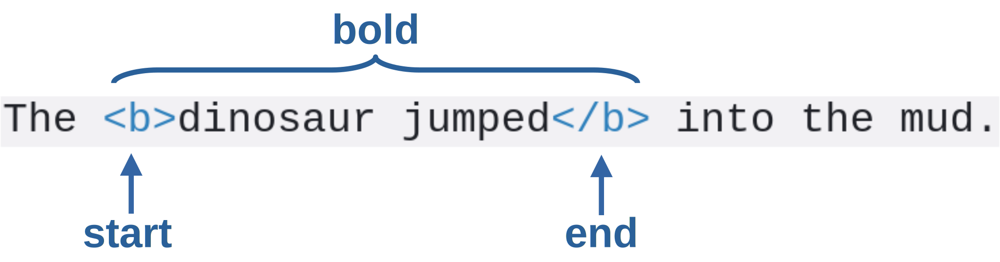
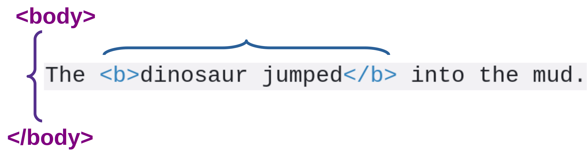
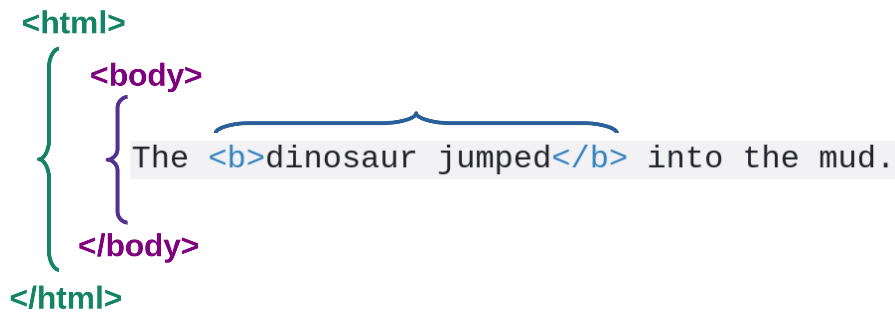

Black & White Series

# HTML Introduction

#### Minimal HTML Page

---

<!-- class: lead -->

# HTML

* HyperText Markup Language
* Invented by Tim Berners-Lee in 1989
* Combines Hypertext + Markup Language
  * Hypertext
    * documents connected by hyperlinks
  * Markup Language
    * uses markup to add information to documents

---

# Experimental environment

### Javascript Playground (https://playcode.io/)
interactive environment ideal for starters

---

# Minimal HTML Page

~~~html
<!DOCTYPE html>
<html>
  <body>
    The dinosaur jumped into the mud.
  </body>
</html>
~~~

* `<!DOCTYPE html>` - HTML5 type
* `<html>` - encompasses entire HTML document
* `<body>` - presented part of the document

---

# Markup

* Distinguished by the symbols `<` and `>`
* Delimits a fragment
  * `<...>` - start
  * `</...>` - end

* Example: markup `<b>` = bold

~~~html
The <b>dinosaur jumped</b> into the mud.
~~~

---

# Bold Markup

---

# Body Markup

---

# HTML Markup

---

# HTML Markup and Tree

---

# Videos / Tutorials

### W3Schools HTML Tutorial
https://www.w3schools.com/html/

### Web and Semantic Web 2015 Playlist
https://youtube.com/playlist?list=PL3JRjVnXiTBZpnuD7ZtJ3fdNsCcR5Oy7B
