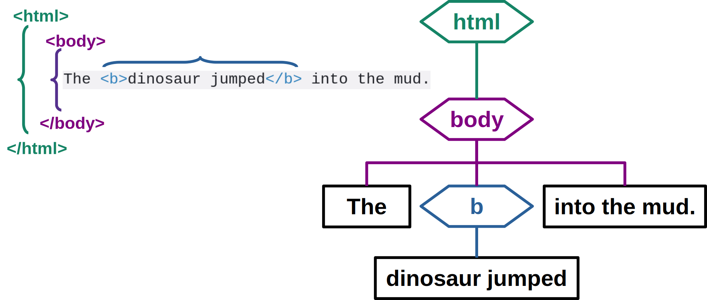

Black & White Series

# HTML Introduction

#### Minimal HTML Page

---

<!-- class: lead -->

# HTML

* HyperText Markup Language
* Invented by Tim Berners-Lee in 1989
* Combines Hypertext + Markup Language
  * Hypertext
    * documents connected by hyperlinks
  * Markup Language
    * uses markup to add information to documents

---

# W3C
### World Wide Web Consortium https://www.w3.org/

* Founded by Tim Berners-Lee in 1994
* Develops and Maintains Web standards
  * including HTML

---

# Experimental environment

### Web2Learn https://santanche.github.io/web2learn
Tutorials, code examples and slides

### Javascript Playground https://playcode.io
Interactive environment ideal for starters

---

# Minimal HTML Page

~~~html
<!DOCTYPE html>
<html>
  <body>
    The dinosaur jumped into the mud.
  </body>
</html>
~~~

* `<!DOCTYPE html>` - HTML5 type
* `<html>` - encompasses entire HTML document
* `<body>` - presented part of the document

---

# Markup

* Based on tags
* Distinguished by the symbols `<` and `>`
* Delimits a fragment
  * `<tag>` - opening tag
  * `</tag>` - closing tag

* Example: tag `<b>` = bold

~~~html
The <b>dinosaur jumped</b> into the mud.
~~~

---

# Bold Tag

---

# Body Tag

---

# HTML Tag

---

# HTML Markup and Tree

---

# Videos / Tutorials

### W3Schools HTML Tutorial
https://www.w3schools.com/html/

### Web and Semantic Web 2015 Playlist
https://youtube.com/playlist?list=PL3JRjVnXiTBZpnuD7ZtJ3fdNsCcR5Oy7B

---

<!-- class: invert -->

## André Santanchè

www.ic.unicamp.br/~santanch/

## Web2Learn

santanche.github.io/web2learn/