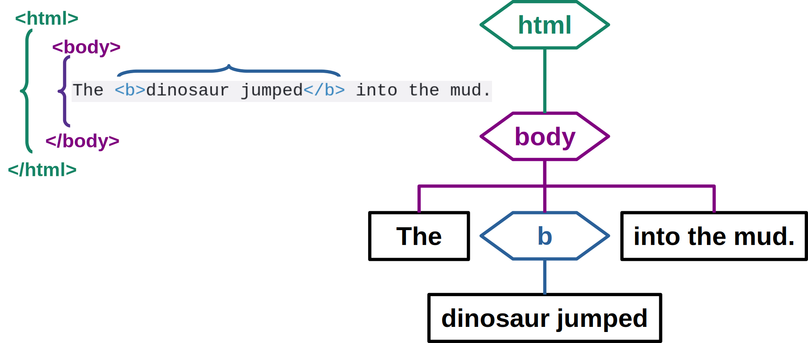
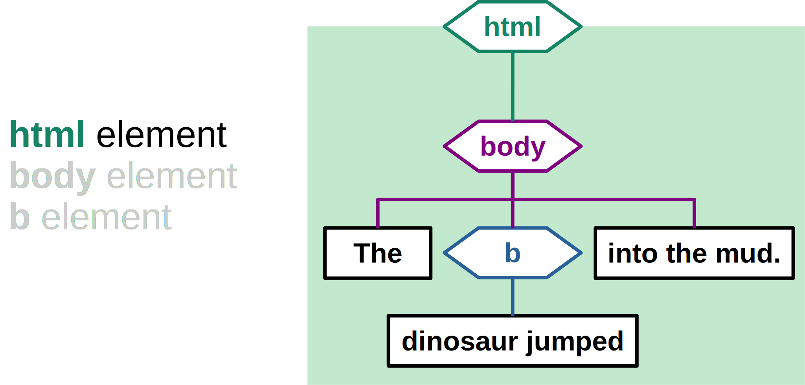
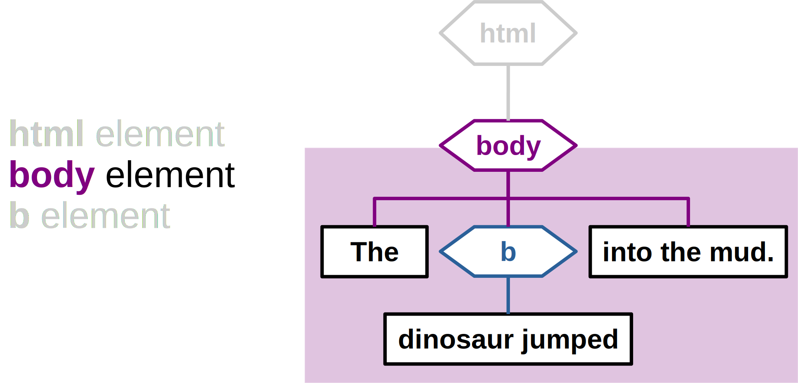
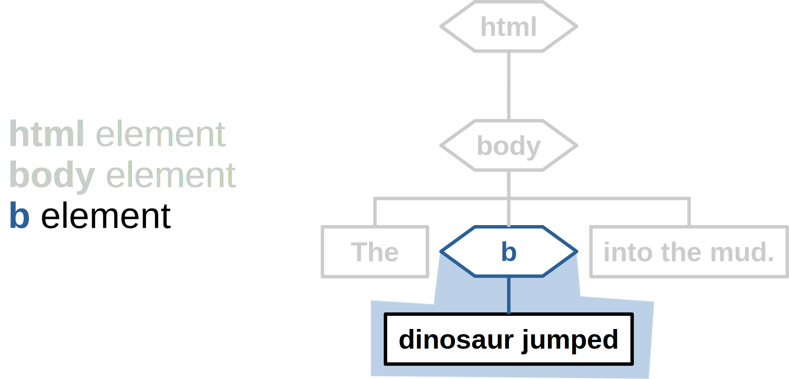
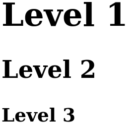
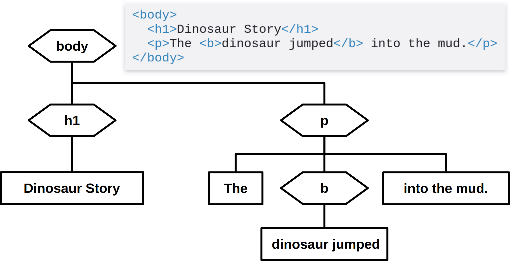
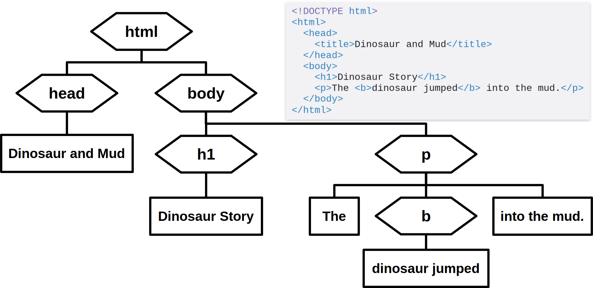

Black & White Series

# HTML Tree

#### Structure and Format

---

<!-- class: lead -->

# Minimal HTML Page

~~~html
<!DOCTYPE html>
<html>
  <body>
    The <b>dinosaur jumped</b> into the mud.
  </body>
</html>
~~~

---

# HTML Markup and Tree

---

# Element

* Tags delimit Elements:
  * element name = tag;
  * element content = everything delimited by the tag.

---

# `html` Element

---

# `body` Element

---

# `b` Element

---

# Header Element `<h_>`

* Document headers in levels

~~~html
<h1>Level 1</h1>
<h2>Level 2</h2>
<h3>Level 3</h3>
~~~

---

# Paragraph Element `
`

* Document headers in levels

~~~html

paragraph 1

paragraph 2

~~~

paragraph 1

paragraph 2

---

# Header and Paragraph Example

~~~html
<!DOCTYPE html>
<html>
  <body>
    <h1>Dinosaur Story</h1>
    
The <b>dinosaur jumped</b> into the mud.

  </body>
</html>
~~~

---

# Document Body Tree

---

# Head `<head>`

* Metadata block of the document
  * not displayed on the page

~~~html
<!DOCTYPE html>
<html>
  <head>
    <title>Dinosaur and Mud</title>
  </head>
  <body>
    <h1>Dinosaur Story</h1>
    
The <b>dinosaur jumped</b> into the mud.

  </body>
</html>
~~~

---

# Document Tree

---

# Videos / Tutorials

### W3Schools HTML Tutorial
https://www.w3schools.com/html/

### Web and Semantic Web 2015 Playlist
https://youtube.com/playlist?list=PL3JRjVnXiTBZpnuD7ZtJ3fdNsCcR5Oy7B

---

<!-- class: invert -->

## André Santanchè

www.ic.unicamp.br/~santanch/

## Web2Learn

santanche.github.io/web2learn/