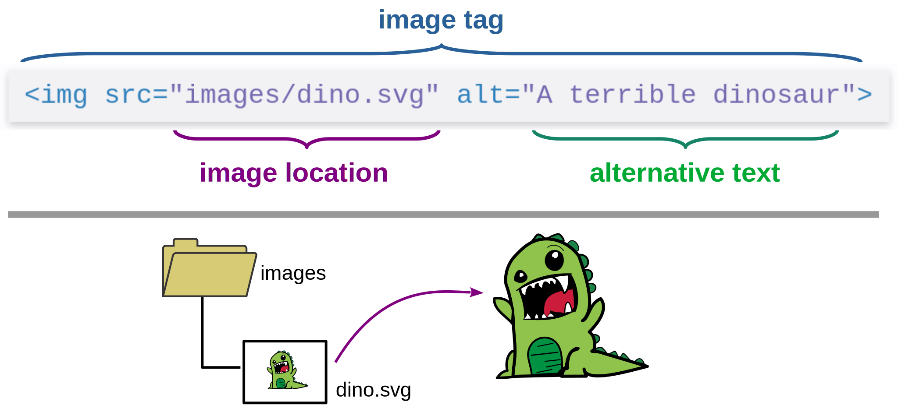

Black & White Series

# References

#### Hyperlinks and Images

---

<!-- class: lead -->

# Anatomy of an Element

--

Based on [MDN Glossary](https://developer.mozilla.org/en-US/docs/Glossary/Element)

---

# Attributes

* Defined inside the opening tag:

~~~html
<tag attr1="value1" attr2="value2">
~~~

* Element
  * can have several attributes
  * with no repeated names

* Example:

~~~html

  The dinosaur jumped into the mud.

~~~

---

# Hyperlink

* Links this document to other Web resources
  * basis of hypertext and web notions
  * web of documents and resources linked

---

# Hyperlink Anatomy

---

# Void Element

* Does not delimit a content
* Has no closing tag

Examples:

* `` - inserts an external image in the element place
* ` ` - skips to the next line

---

# Image Anatomy

---

# Absolute x Relative

~~~html
<h1>Relative</h1>

<h1>Absolute</h1>
<h2><a href="https://xkcd.com/1452/">Jurassic World</a></h2>

~~~

---

# Absolute x Relative

---

<!-- class: invert -->

## André Santanchè

www.ic.unicamp.br/~santanch/

## Web2Learn

santanche.github.io/web2learn/