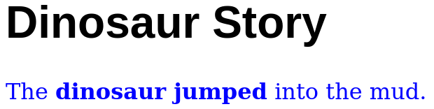

Black & White Series

# Page Styles

---

<!-- class: lead -->

# `style` Attribute

* Defines the presentation styles of an element

* Examples of styles:
  * color
  * letter font
  * letter size
  * background color

---

# Example

~~~html
<h1>Dinosaur Story</h1>

  The <b>dinosaur jumped</b> into the mud.

~~~

---

# Example

~~~html
<h1 style="font-family:Arial">Dinosaur Story</h1>

  The <b>dinosaur jumped</b> into the mud.

~~~

---

# Style Scope

The style reaches the element scope

---

# Style Scope Hierarchy

Inner scopes replace outer ones

~~~html

  The <b style="color:green">dinosaur jumped</b> into the mud.

~~~

---

# Videos / Tutorials

### W3Schools HTML Tutorial
https://www.w3schools.com/html/

### Web and Semantic Web 2015 Playlist
https://youtube.com/playlist?list=PL3JRjVnXiTBZpnuD7ZtJ3fdNsCcR5Oy7B
