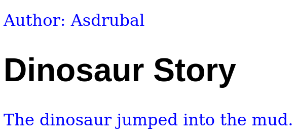

Black & White Series

# Separation Content-Style

### CSS - Cascading Style Sheet

---

<!-- class: lead -->

# CSS
### Cascading Style Sheets

* Styling language
* First release by W3C in 1996
* Describes presentation of HTML and XML documents

---

# Last Styling Example

~~~html
<html>
  <body>
    <h1 style="font-family:Arial">Dinosaur Story</h1>
    

      The <b style="color:green">dinosaur jumped</b> into the mud.
    

  </body>
</html>
~~~

---

# Separation Content-Style

---

# HTML & CSS

---

# `style` element - `head`

~~~html
<!DOCTYPE html>
<html>
  <head>
    
  </head>
  <body>
    <h1>Dinosaur Story</h1>
    
The <b>dinosaur jumped</b> into the mud.

  </body>
</html>
~~~

---

# Styling Elements

Three strategies based on:

* element tags
* classes
* unique identifiers

---

# Styling Elements by Tag

* Styles all elements with the same tag

~~~html

...

Author: Asdrubal

<h1>Dinosaur Story</h1>

The dinosaur jumped into the mud.

~~~

---

# Styling Elements by Tag

---

# Styling Elements by Class

* Styles all elements with the same class
  * a class is prefixed by a dot

~~~html

...

Author: Asdrubal

<h1 class="story">Dinosaur Story</h1>

The dinosaur jumped into the mud.

~~~

---

# Styling Elements by Class

---

# Styling Elements by Id

* Styles an element identified by an id
  * the id attribute value is unique

~~~html

...

Author: Asdrubal

<h1>Dinosaur Story</h1>

The dinosaur jumped into the mud.

~~~

---

# Styling Elements by Id

---

# External CSS File

---

# Central CSS for Pages

---

# Videos / Tutorials

### W3Schools HTML Tutorial
https://www.w3schools.com/html/

### Web and Semantic Web 2015 Playlist
https://youtube.com/playlist?list=PL3JRjVnXiTBZpnuD7ZtJ3fdNsCcR5Oy7B

---

<!-- class: invert -->

## André Santanchè

www.ic.unicamp.br/~santanch/

## Web2Learn

santanche.github.io/web2learn/