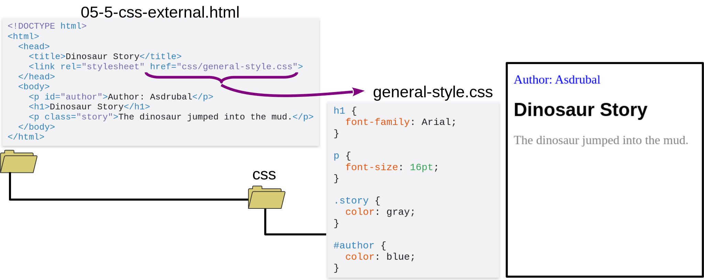
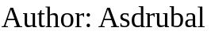
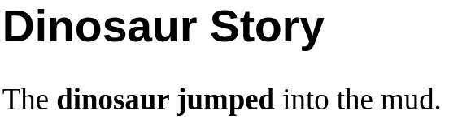

Black & White Series

# Generic Elements

### `` and `
`

---

<!-- class: lead -->

# `` and `
`

* `` - generic inline element
* `
` - generic element for flow content
  * everything not inline

---

# External CSS File

---

# Styling Inline with ``

`general-style.css`

~~~css
#author { color: blue; }
~~~

HTML

~~~html

Author: Asdrubal

~~~

---

# Styling Inline with ``

### `general-style.css`
~~~css
#author { color: blue; }
~~~

### HTML
~~~html

Author: Asdrubal

~~~

---

# Styling Block with `
`

`general-style.css`

~~~css
.story { color: gray; }
~~~

HTML

~~~html
<h1>Dinosaur Story</h1>

The dinosaur jumped into the mud.

~~~

---

# Styling Block with `
`

`general-style.css`

~~~css
.story { color: gray; }
~~~

HTML

~~~html

  <h1>Dinosaur Story</h1>
  
The dinosaur jumped into the mud.

~~~

---

# Replacing Specialized Formats

* Replacing tags specialized in a format, like `<b>` (bold) and `<i>` (italic):

~~~css
.emphasis { font-weight: bold; }
~~~

HTML

~~~html

The dinosaur jumped into the mud.

~~~

---

<!-- class: invert -->

## André Santanchè

www.ic.unicamp.br/~santanch/

## Web2Learn

santanche.github.io/web2learn/