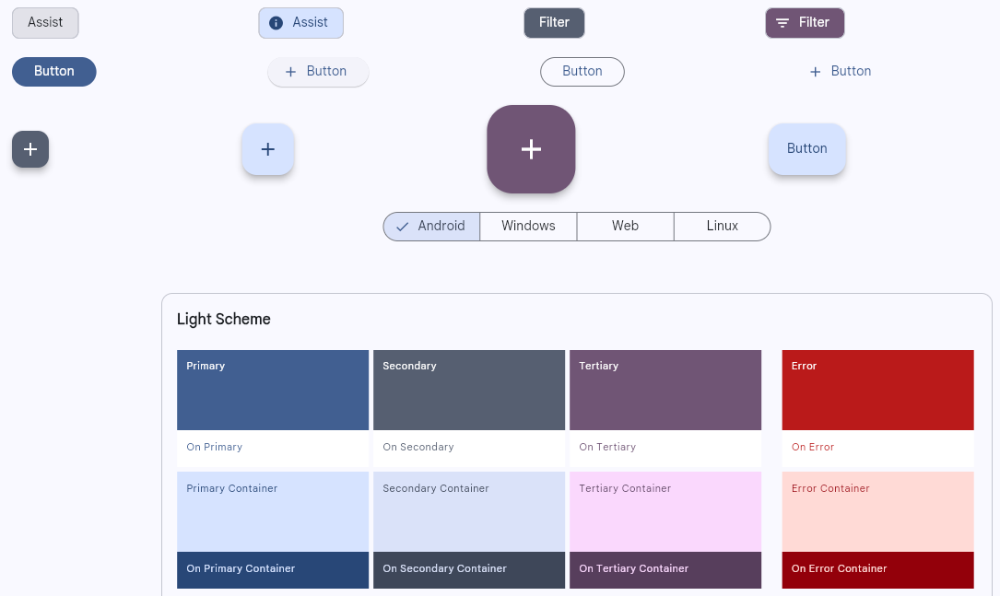
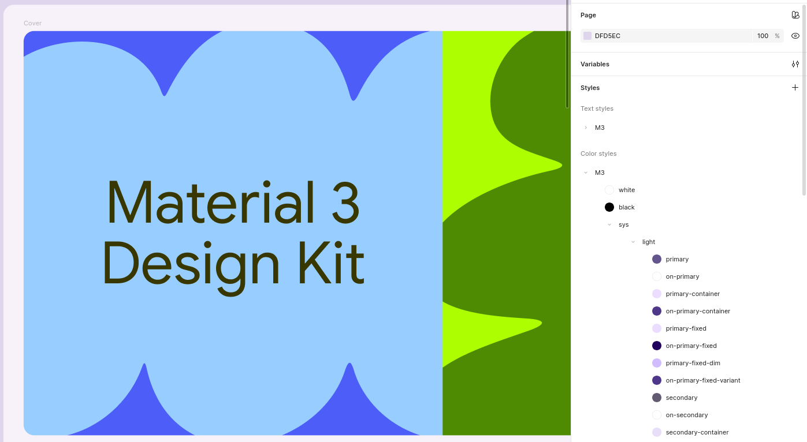

# Design System Roadmap

## Introduction

* Start learning about design tokens with a well-organized, mature system:
  [Material Design Tokens](https://m3.material.io/foundations/design-tokens/overview)

* Experiment with this tool that automates Material 3 theme creation to understand how parts fit together:
  [Material Theme Builder](https://material-foundation.github.io/material-theme-builder/)

  

* Learn how the Material 3 organizes its hierarchy of design tokens as styles on Figma using this library:
  [Material 3 Design Kit](https://www.figma.com/community/file/1035203688168086460)

  

* Analyze how Material Theme Builder exports its tokens to CSS:
  [Material Theme Builder exported CSS](css/light.css)

  ~~~css
  .light {
    --md-sys-color-primary: rgb(65 95 145);
    --md-sys-color-surface-tint: rgb(65 95 145);
    --md-sys-color-on-primary: rgb(255 255 255);
    --md-sys-color-primary-container: rgb(214 227 255);
    --md-sys-color-on-primary-container: rgb(40 71 119);
    ...
  }
  ~~~

## Naming Tokens

* Learn about Design System foundations:
  [Design tokens, what?](https://thedesignsystem.guide/design-tokens)

* Study this comparative study that guides how to create names of your Design Tokens:

  Curtis, N. (2020). Naming Tokens in Design Systems. Terms, Types, and Taxonomy to Describe… | by Nathan Curtis | EightShapes | Medium. https://medium.com/eightshapes-llc/naming-tokens-in-design-systems-9e86c7444676

